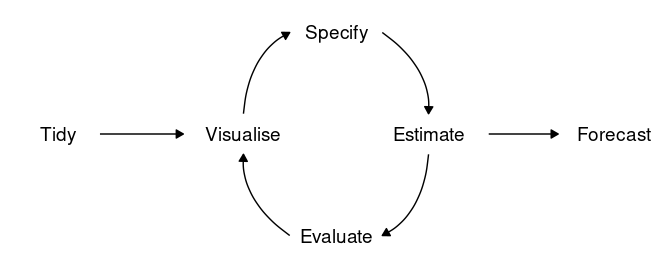
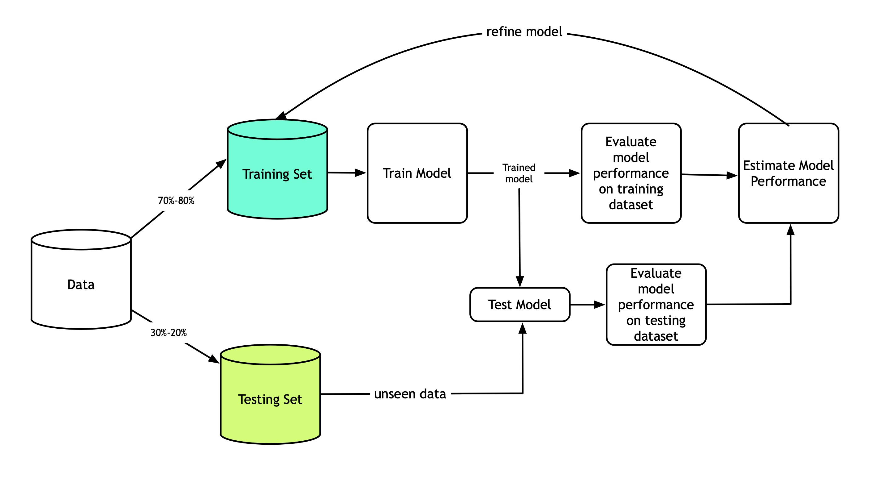
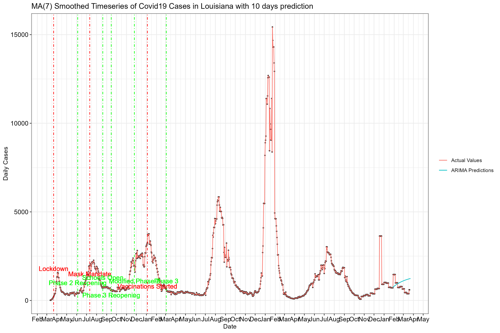

```{r setup, include=FALSE}
knitr::opts_chunk$set(echo = TRUE, warning = FALSE,fig.align = 'center', message = FALSE, tidy.opts=list(width.cutoff=80), tidy=TRUE) 
options(scipen = 1, digits = 3)
```


# Description and preamble

This document will explain the inner workings of the code TG_TimeSeries_1_2.R which is used to analyze the covid19 number of cases and deaths in Louisiana.
Make sure you have installed all the libraries bellow. You can do that from the tab packages in R-Studio. The typical workflow for time series analysis is as follows 




## Libraries and functions

The following libraries are quite useful when analyzing time series and creating graphs with them. fpp2, zoo, and urca are modeling and forecasting packages, whereas GGally, gridExtra and ggrepel are useful for creating better graphs with ggplot2. 
Tidyverse is the go to package for data analysis, lubridate handles date manupulations and foreign is used to read data into R from various formats. Finally, psych contains various statistical functions which are especially useful and hydroGOF contains the RMSE function. 

```{r}
rm(list = ls())
setwd(dirname(rstudioapi::getActiveDocumentContext()$path))
library(easypackages)
libraries("fpp2","zoo","tidyverse","lubridate","GGally","gridExtra","ggrepel","foreign", "urca","psych","hydroGOF")
source("./Functions/TSConvert.R") # adds the function 
```

Note that the command at the end, utilizes the function TSConvert from the folder Functions. This is a custom function that I have created which quickly converts a variable to a timeseries from a dataframe that contains a Date column. 

Also, for advanced versions of R studio the line setwd(...) automatically sets the working directory to the same location as the code. Still, if you are unsure that this worked you can always set the working directory to the source file location manually.  

## Read data, keep latest, format dates

```{r}
df=read.csv("https://raw.githubusercontent.com/nytimes/covid-19-data/master/us-states.csv")
df1=df%>%filter(state=="Louisiana")%>%select(date,cases,deaths)
colnames(df1)=str_to_title(colnames(df1)) 
df1$Date=as.Date(df1$Date)
write.csv(df1,"../Data/Processed/Cleandata1.csv")
```

The data is read directly from a repository maintained by the New York times. So far this has been a reliable source with a stable flow of data. We then use tidyverse's commands to filter our data and keep only information about Louisiana and select only date, cases and deaths. 
The function str_to_title changes the names of the variables so that the first letter is capitalized. A good idea is to have the variable names with capital letter or at least the first letter capitalized, to distinguish them from the entries inside the dataframe. 

We mentioned before that R most of the times understand Date data, but it is a good idea to make sure we set it like that with the command as.Date. This function allows us to change format if needed. Look it up!

Also, after you clean up the data, it is a good idea to save them as a csv file in the processed folder. Note that each time a new dataset comes in the cleandata1 will be overwritten! 

```{r}
dir.create(paste0("../Results/",df1$Date[nrow(df1)]),showWarnings = F)
```
Since we will need a place to save the results, and this process will be repeated, it is a good idea to create folders for the answers that are connected with the latest date of the data. The dir.create is a command that allows R to make folders. Mac and Linux users might need to give R special privileges but it normally works just fine. Note also the use of the function paste0() which allows us to create path names with fixed parts and variables parts. 

# Data Exploration

It is always a good idea to get a feeling of your data before you even attempt to analyze it. Simple graphs can go a long way, as well as some summary statistics. 

## Graphs for Cumulative Cases and Deaths 

The following graphs give us an idea of the timeseries for cumulative cases and deaths. The R-cookbook and specifically the chapter about graphs can give you a lot of information about how to create good graphs with ggplot2. This webpage by statistics.io has a list of the most used plots: <http://r-statistics.co/Top50-Ggplot2-Visualizations-MasterList-R-Code.html>

```{r}
p1=ggplot(df1, aes(x=Date, y=Cases)) +
  geom_point(size=0.5)+
  scale_x_date(breaks = "1 month",date_labels="%b")+
  geom_line(color="#00AFBB") + xlab("") + ylab("Daily Cases")+ 
  ggtitle("Timeseries of Cumulative Cases")+
  theme_classic()
ggsave(paste0("../Results/",df1$Date[nrow(df1)],"/Cases.jpg"),width=10,heigh=10,p1) 
p1
```


```{r}
p1=ggplot(df1, aes(x=Date, y=Deaths)) +
  geom_point(size=0.5)+
  scale_x_date(breaks = "1 month",date_labels="%b")+
  geom_line(color="#00AFBB") + xlab("") + ylab("Daily Deaths")+ 
  ggtitle("Timeseries of Cumulative Deaths")+
  theme_classic()
ggsave(paste0("../Results/",df1$Date[nrow(df1)],"/Deaths.jpg"),width=10,heigh=10,p1) 
p1
```

Note that the dataset does not contain the daily cases and deaths but the cumulative daily cases and deaths. Of course this is the same amount of information, but if we need to analyze the data we need to extract the daily cases and create some sort of moving average. 

## Creating moving averages and adding them to the dataset

Extracting the first day of the dataset and use that to define our time series. Note the use of strsplit so we can obtain the year-month-day breakdown
```{r}
StartDay=df1$Date[1]
yr_mt_da=as.numeric(strsplit(as.character(StartDay),"-")[[1]])
```

### Creating the Daily Cases and their moving Average

```{r}
Casests <- ts(df1$Cases, start=yr_mt_da,frequency=365.25)
Casets1=c(Casests[1],diff(Casests,1))
Casests_ma=ma(Casets1,7)
df1$DailyCases=as.vector(Casets1)
df1$Cases_ma=as.vector(Casests_ma)
```

### Creating the daily deaths and their moving average

```{r}
Deathsts <- ts(df1$Deaths, start=yr_mt_da,frequency=365.25)
Deathsts1=c(Deathsts[1],diff(Deathsts,1))
Deathsts_ma=ma(Deathsts1,7)
df1$DailyDeaths=as.vector(Deathsts1)
df1$Deaths_ma=as.vector(Deathsts_ma)
```

## Creating the summary Statistics and Saving it as a csv

The following code utilized the function describe from the package psych to give us the basic summary statistics for our dataset. This is saved in the created results folder and the data itself is added to the proccesed data folder. Again new itterations of the data overwrite the previous ones. 

```{r}
SumStats=describe(df1,na.rm=TRUE,trim=0.1,quant=c(.25,.75))
write.csv(SumStats,paste0("../Results/",df1$Date[nrow(df1)],"/Summary_Statistics.csv"))
write.csv(df1,"../Data/Processed/Cleandata.csv")
head(df1,5)
```


# Basic Analysis 

We are now ready to do the basic analysis of the dataset. 

## Train-test split. 

In practically all analyses of this type, when multiple prediction models are compared the process is similar. 



## Parameter Set up

We need to first set up various parameters, which our models will use to do the predictions. It is always a good idea to have a chunk with all the "changing parameters" so that a quick change here affects the whole code later. Make sure that you set all parameters as variables instead of definitive numbers. This makes tweaking those parameters easy in the future.


```{r}
d=0.05
h=10
k=round(nrow(df1)*d)
l=nrow(df1)-k
train=df1[1:l,]
test=df1[(l+1):nrow(df1),]
freq=365.25
```

Let's try to explain the parameters one by one: 

* d is the percentage of the data that we will use a test set. The train test split is specific to the timeseries we analyze. Normally splits of 70-30, 80-20 are found in the bibliography especially when dealing with monthly and weekly data. For daily data, and timeseries which are very messy and unpredictable, predicting a 5 percent or even a 1 percent is considered normal, so a 95-5 percent is appropriate. 

* h is the number of days we will try to predict in the future using the best prediction models. For daily data on volatile timeseries a 10 day window is already pushing the prediction accuracies. 

* k is the actual number of days in the test dataset. It is computed automatically.

* l is the actual number of days in the train dataset. It is computed automatically.

* train is a subset of the data that will be used for training the models. It is computed automatically 

* test is a subset of the data that will be used for testing the models. It is computed automatically. 

* freq handles the time unit. For daily data this needs to be 365.25, for montlhy data it is 12, for weekly it is 52 and for yearly it is 1.

## Analysis For Cases 

The following code, utilized the function TSConver, to create the timeseries for training, testing and their combination. Note that we are using the moving average cases, since the daily cases are very volatile and every sunday data is not reported anyway. 

```{r}

Allcases_train=TSConvert(train,"Cases_ma",freq)
Allcases_test=TSConvert(test,"Cases_ma",freq)
AllCases=c(Allcases_train,Allcases_test)
```

### Neural Network Models

The following chunk trains a Neural Network that I have created with specific parameters that most of the time work well for daily time series data. Then it forecasts the same amount of days as we have on the training set and plots the result.

```{r}
fit1=nnetar(Allcases_train,p=7,Size=10,repeats=50,lambda = "auto")
for1=forecast(fit1,k)
autoplot(for1)
predictions1=for1$mean
autoplot(predictions1)
```

The following chunk trains a Neural Network that I has automatically defined parameters that comes pre-installed with the fpp2 package. Then it forecasts the same amount of days as we have on the training set and plots the result.

```{r}
fit2=nnetar(Allcases_train)
for2=forecast(fit2,k)
autoplot(for2)
predictions2=for2$mean
autoplot(predictions2)
```

### ARIMA Models 

The most useful and well known time series forecasting model is call AutoRegressive Integrated Moving Average (ARIMA). More information about it can be found in the book Forecasting Principles and Practice <https://otexts.com/fpp2/>

The following chunk trains an automatically defined ARIMA model that comes pre-installed with the fpp2 package.Then it forecasts the same amount of days as we have on the training set and plots the result.
```{r}
fit3=auto.arima(Allcases_train) 
for3=forecast(fit3,h=k)
autoplot(for3)
predictions3=for3$mean
autoplot(predictions3)
```

And here is the same analysis with an ARIMA model of my choosing. 

```{r}
fit4=arima(Allcases_train,order=c(4,0,1))
for4=forecast(fit4,k)
autoplot(for4)
predictions4=for4$mean
autoplot(predictions4)
```

### Creating a Results Table and save everything 

In order to collect all the results in one place we will create a new dataframe and store there all the predictions.

```{r}
results=data.frame(Date=test$Date,Test=test$Cases_ma,PredNN=as.vector(predictions1),
                   PredAutoNN=as.vector(predictions2),PredAutoARIMA=as.vector(predictions3),
                   PredARIMA=as.vector(predictions4))

results$Ensemble1=rowMeans(results[,c(4,5)])
results$Ensemble2=rowMeans(results[,3:6])

head(results,5)
```

Note that we artificially introduce two new predictive models, the Ensemble1, which is the average of the Automatic Neural Network and the Automatic Arima. Ensemble2 is the average of all predictive models. It is generally true that when multiple prediction models are averaged (or weighted and averaged) then the prediction accuracy increases especially if all the models are good to begin with.  

### Creating a basic plot with all the predictive models

The following graph contains the comparison of all the models we have created 


```{r}
p1=ggplot() +
  geom_line(data=df1, aes(x = Date, y = Cases_ma, colour = "Actual Values"))+
  geom_line(data = results, aes(x = Date, y = Test, colour = "Actual Values")) +
  geom_line(data = results, aes(x = Date, y = PredNN,   colour = "Predictions NN"))  +
  geom_line(data = results, aes(x = Date, y = PredARIMA,   colour = "Predictions ARIMA"))  +
  geom_line(data = results, aes(x = Date, y = PredAutoARIMA,   colour = "Predictions Auto ARIMA"))  +
  geom_line(data = results, aes(x = Date, y = PredAutoNN,   colour = "Predictions Auto Neural Network"))  +
  geom_line(data = results, aes(x = Date, y = Ensemble1,   colour = "Predictions Ensamble1"))  +
  geom_line(data = results, aes(x = Date, y = Ensemble2,   colour = "Predictions Ensamble2"))  +
  ylab('Cases')+
  scale_x_date(breaks = "1 month",date_labels="%b")+
  #scale_x_date(breaks=df1$Date ,labels=format(df1$Date,format="%m-%d"))+
  ggtitle(paste0("Comparison of Predicted vs True Number of Smoothed (7) Cases for ",round(nrow(df1)*d)," days"))+
  theme(axis.text.x = element_text(angle=45, hjust = 1))
ggsave(paste0("../Results/",df1$Date[nrow(df1)],"/Predictions_vs_Test_days_",k,"_Cases.jpg"),p1,width=10,heigh=8)
p1
```

### Computing the mean square errors and finding the best predictors

For numerical data like this, the most appropriate measure of accuracy is the Root Mean Square Error (RMSE). 

Given two vectors of numbers $X=(x_1,x_2, ... x_n)$ and $Y=(y_1,y_2,..., y_n)$ let's say the test set, and the prediction values, the "distance" between them is computed as follows: $$RMSE(X,Y)=\sqrt{\frac{\sum_{i=1}^n (x_i-y_i)^2}{n}}$$

The closer that distance is to zero the better it is. 

THe following code creates an empty dataframe to store the results for the RMSE computations for each predictive model. 

```{r}
RMSE=matrix(0,nrow=1,ncol = ncol(results)-2) 
RMSE=as.data.frame(RMSE)
colnames(RMSE)=colnames(results[,3:ncol(results)])
for (i in 1:ncol(RMSE)){
  RMSE[1,i]=rmse(results[,2],results[,i+2],na.rm=TRUE)
}
write.csv(RMSE,paste0("../Results/",df1$Date[nrow(df1)],"/Smoothed_7_RMSE_days_",k,"_Cases.csv"))
RMSE
```

The output RMSE matrix is saved as a csv file in the newly created Results folder.

### Graphing The results with important dates

The following set's up dates that were important in Louisiana. 

```{r}
geom.text.size = 4
theme.size = (14/5) * geom.text.size
Lck=as.Date("2020-03-22")
Ph2=Lck+74
Msk=Lck+111
ScOpen=Lck+151
Ph3=Lck+177
MPh2=Lck+248
Vac=Lck+288
Ph3N=Lck+346
```

The ggplot here is quite involving since it contains all the basic moves the Louisiana government did. 

```{r}
p1=ggplot(df1, aes(x=Date, y=Cases_ma)) +
  geom_point(size=0.5)+
  geom_line(data=df1, aes(x = Date, y = Cases_ma, colour = "Actual Values"))+
  geom_line(data=results, aes(x = Date, y = PredARIMA, colour = "ARIMA Predictions"))+
  geom_text(x=Lck, y=1800, label="Lockdown",colour="red",size=geom.text.size)+
  geom_vline(xintercept=Lck, linetype=4,colour="red")+
  geom_text(x=Ph2, y=1000, label="Phase 2 Reopening",colour="green",size=geom.text.size)+
  geom_vline(xintercept=Ph2, linetype=4,colour="green")+
  geom_text(x=Msk, y=1500, label="Mask Mandate",colour="red",size=geom.text.size)+
  geom_vline(xintercept=Msk, linetype=4,colour="red")+
  geom_text(x=ScOpen, y=1300, label="Schools Open",colour="green",size=geom.text.size)+
  geom_vline(xintercept=ScOpen, linetype=4,colour="green")+
  geom_text(x=Ph3, y=300, label="Phase 3 Reopening",colour="green",size=geom.text.size)+
  geom_vline(xintercept=Ph3, linetype=4,colour="green")+ 
  geom_text(x=MPh2, y=1100, label="Modified Phase 2",colour="green",size=geom.text.size)+
  geom_vline(xintercept=MPh2, linetype=4,colour="green")+
  geom_text(x=Vac, y=800, label="Vaccinations Started",colour="red",size=geom.text.size)+
  geom_vline(xintercept=Vac, linetype=4,colour="red")+
  geom_text(x=Ph3N, y=1100, label="Phase 3",colour="green",size=geom.text.size)+
  geom_vline(xintercept=Ph3N, linetype=4,colour="green")+
  scale_x_date(breaks = "1 month",date_labels="%b")+
  ylab("Daily Cases")+
  ggtitle(paste0("MA(7) Smoothed Timeseries of Covid19 Cases in Louisiana with ",h," days prediction"))+
  theme_bw()+
  theme(axis.text = element_text(size = theme.size, colour="black"))+
  theme(legend.title = element_blank())
```

The following code saves the graph at the designated folder with specific width and height. This is very useful, especially if this is in a google repository where the link can be embedded on a webpage, and re-newed at will

```{r}
ggsave(paste0("../Results/",df1$Date[nrow(df1)],"/Smoothed_With_",h,"_days_prediction_Cases.jpg"),width=12,heigh=8,p1) 
ggsave(paste0("../Results/Latest_Smoothed_With_",h,"_days_prediction_Cases.jpg"),width=12,heigh=8,p1) 
```



# General Forecasting

```{r}
fitfinal = auto.arima(AllCases)
forfinal = forecast(fitfinal, h = 7)
autoplot(forfinal)
predictionsfinal=forfinal$mean
autoplot(predictionsfinal)
```


